## 题目链接
https://leetcode.cn/problems/UHnkqh/
## 题目描述
给定单链表的头节点 head ，请反转链表，并返回反转后的链表的头节点。

示例 1：

输入：head = [1,2,3,4,5]
输出：[5,4,3,2,1]
示例 2：

输入：head = [1,2]
输出：[2,1]
示例 3：

输入：head = []
输出：[]

## 题解
### 1. 三指针
第一个指针记录前一个node 初始为head的next Right
第二个指针记录当前node   初始为head       Mid
第三个指针记录后一个node 初始为null       Left  

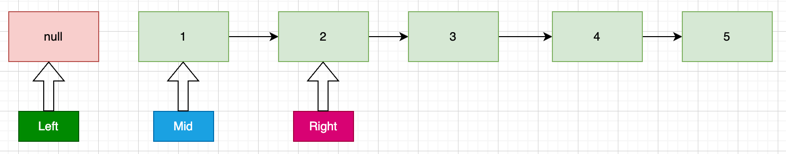

每次反转当前指针mid，所有指针前移一步。
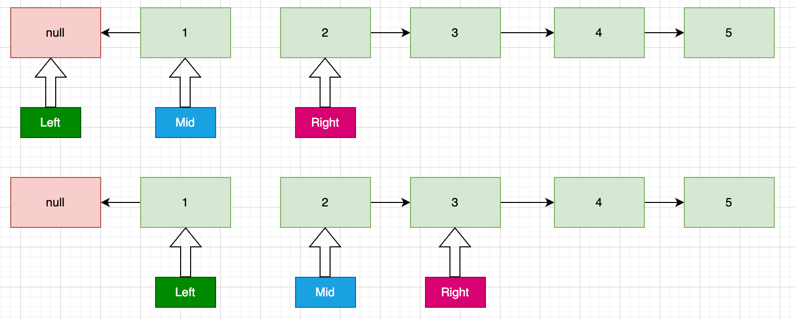
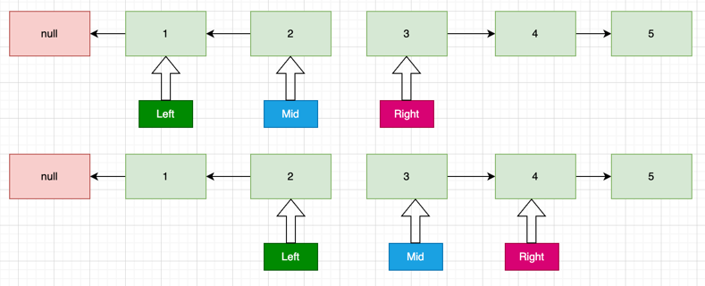

第一个指针指向为空时，则当前指针为已经走到了链表末位。此时left为头的链表已全部反转，最后将mid的next指向left即可完成链表的全部反转。
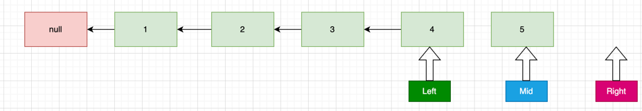
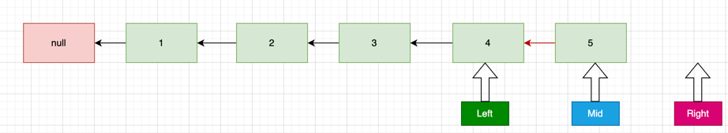

### 2.双指针
一个指针指向新链表的头结点
一个指针指正旧链表的头结点

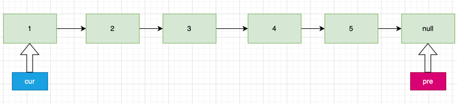

算法步骤：
1. 下一步会更改cur.next导致丢失后续链表，所以需要提前存储下一个节点 tmp = cur.next
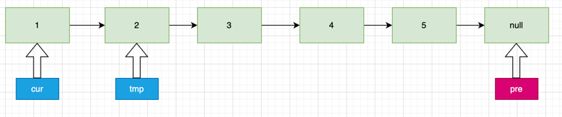
2. 将cur的next指向pre cur.next=pre
3. 将pre更新为cur pre = cur
4. 更新cur为下一个节点 cur = tmp
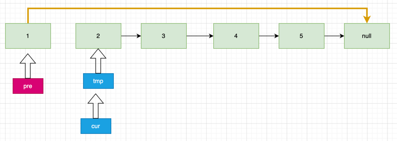
5. 当旧链表的头结点为null时，则链表已全部反转
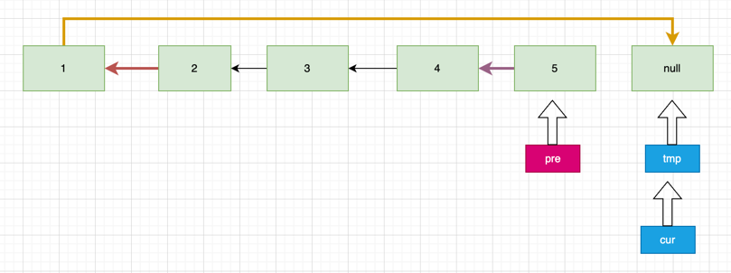
6. 返回pre，新链表的头结点。

### 3.递归
思路：以链表12345为例。
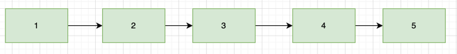
（重复子问题可使用递归）不断缩短链表的长度。缩短到只有一个时则不需要反转，缩短到第n个时（假如有n+1个）,则只需将第n+1个的next指向第n个，然后将第n个的next指向null。
步骤1. 将n+1的next指向n n.next.next = n
步骤2. 将n的next指向null n.next = null

**递归模版**
> 1.判断递归终止条件   
> 缩短到只有一个时则不需要反转
> if(head==null || head.next==null) return head;
> 
> 2.处理当前层 
> 
> 当前层没有特殊操作，不断递归到下一层，然后回溯时进行处理
> 
> 3.向下层递归   
> 
> newHead = method(head.next)
> 
> 4.回溯时清理当前层 
>  
> 当递归到最后一层n+1层时符合递归条件，开始回溯第n+1层结束 newHead = n+1,此时到达第n层，执行上述步骤1和步骤2即可完成反转。
> 最后返回newHead，即链表的头结点。
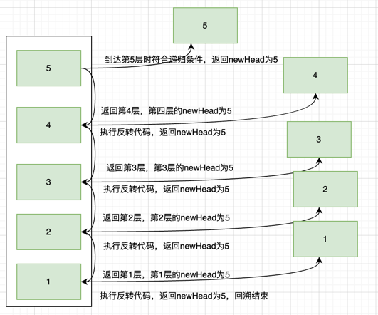
